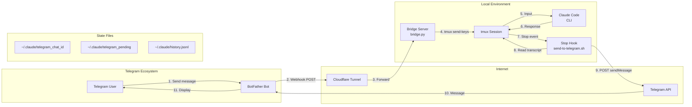

# System Architecture Specification

## Overview

**Project:** claudecode-telegram  
**Purpose:** Telegram bot bridge enabling bidirectional communication between Telegram users and Claude Code sessions

---

## System Diagram

---

## Components

### 1. Bridge Server (`bridge.py`)

**Type:** HTTP Server (Python `http.server`)

**Responsibilities:**
- Receives Telegram webhook updates
- Routes messages to Claude Code via tmux
- Handles bot commands (`/status`, `/clear`, `/resume`, `/loop`, `/stop`)
- Manages session resumption UI
- Maintains typing indicator loop

**Ports:** Configurable via `PORT` env var (default: 8080)

---

### 2. Stop Hook (`hooks/send-to-telegram.sh`)

**Type:** Bash script with embedded Python

**Trigger:** Claude Code's `Stop` hook event

**Responsibilities:**
- Reads transcript after Claude finishes responding
- Extracts assistant response from transcript
- Formats response with HTML markup (code blocks, inline code, bold, italic)
- Sends formatted response back to Telegram
- Cleans up pending state file

---

### 3. State Management Files

| File | Purpose | Created By |
|------|---------|------------|
| `~/.claude/telegram_chat_id` | Stores last active chat ID | Bridge |
| `~/.claude/telegram_pending` | Flag file indicating pending response | Bridge |
| `~/.claude/history.jsonl` | Session history for resumption | Claude Code |

---

## Data Flow

### Request Path (User → Claude)

1. **User sends message** to bot on Telegram
2. **Telegram API** POSTs webhook to bridge server
3. **Bridge** writes chat ID to `telegram_chat_id`
4. **Bridge** writes timestamp to `telegram_pending` (flag for response)
5. **Bridge** injects message into tmux via `tmux send-keys`
6. **Claude Code** processes message in tmux session

### Response Path (Claude → User)

1. **Claude Code** finishes generating response
2. **Stop hook** fires, executing `send-to-telegram.sh`
3. **Hook** checks `telegram_pending` exists (validates Telegram-initiated)
4. **Hook** reads transcript, extracts last assistant response
5. **Hook** formats response with HTML (code blocks, emphasis)
6. **Hook** POSTs to Telegram `sendMessage` API
7. **Hook** removes `telegram_pending` flag

---

## Design Decisions

### 1. Pending Flag Pattern

**Problem:** Hook fires for ALL Claude responses, including local CLI usage.

**Solution:** Bridge writes `telegram_pending` file when receiving Telegram message. Hook only responds if file exists.

**Benefits:**
- Prevents hook from responding to local CLI sessions
- Simple file-based coordination (no IPC complexity)
- Atomic flag operation

### 2. tmux as Message Transport

**Problem:** Need to inject messages into running Claude Code process.

**Solution:** Use `tmux send-keys` to simulate keyboard input.

**Benefits:**
- No modification to Claude Code required
- Works with any CLI tool
- Preserves full Claude Code functionality

### 3. Inline Python in Bash Hook

**Problem:** Need complex text processing (HTML formatting, escaping) in hook.

**Solution:** Embed Python code in bash script.

**Benefits:**
- Single file deployment
- Python's regex/string capabilities
- No external dependencies beyond Python 3

### 4. HTTP Server over Framework

**Problem:** Need lightweight webhook receiver.

**Solution:** Use Python's built-in `http.server`.

**Benefits:**
- Zero dependencies
- Minimal overhead
- Sufficient for single-purpose server

---

## Configuration

### Environment Variables

| Variable | Default | Description |
|----------|---------|-------------|
| `TELEGRAM_BOT_TOKEN` | *required* | Bot token from BotFather |
| `TMUX_SESSION` | `claude` | tmux session name |
| `PORT` | `8080` | Bridge server port |

---

## Dependencies

### Runtime
- Python 3.10+
- tmux
- cloudflared (for tunneling)
- jq (in hook script)

### Development
- pytest (for tests)

---

## Security Considerations

1. **Bot Token Exposure:** Token stored in environment, not committed
2. **No Authentication:** Bridge accepts any webhook (relies on Telegram's webhook security)
3. **Local-only:** Bridge binds to localhost, requires tunnel for external access
4. **Command Injection:** User input passed directly to tmux (trusted user model)

---

## Extensibility Points

1. **Additional Bot Commands:** Extend `BOT_COMMANDS` list and `handle_message()`
2. **Multiple Sessions:** Modify session management in hook
3. **Response Filtering:** Add content filtering before sending to Telegram
4. **Logging:** Add structured logging to bridge server
5. **Rate Limiting:** Add request throttling for Telegram API calls
