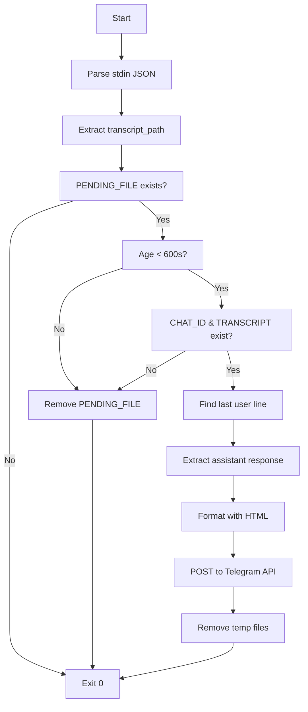

# Stop Hook Specification

## Overview

The stop hook (`hooks/send-to-telegram.sh`) is a bash script executed by Claude Code's Stop hook event. It reads the conversation transcript, extracts the assistant's response, formats it with HTML markup, and sends it back to Telegram.

---

## Installation

```bash
cp hooks/send-to-telegram.sh ~/.claude/hooks/
nano ~/.claude/hooks/send-to-telegram.sh  # Set TELEGRAM_BOT_TOKEN
chmod +x ~/.claude/hooks/send-to-telegram.sh
```

Add to `~/.claude/settings.json`:
```json
{
  "hooks": {
    "Stop": [
      {
        "hooks": [
          {
            "type": "command",
            "command": "~/.claude/hooks/send-to-telegram.sh"
          }
        ]
      }
    ]
  }
}
```

---

## Input Format

The hook receives Claude Code's stop event as JSON on stdin:

```json
{
  "transcript_path": "/path/to/transcript.jsonl",
  "session_id": "session-123",
  "timestamp": 1234567890
}
```

### Transcript Format (JSONL)

Each line is a JSON object:

```jsonl
{"type":"user","message":{"content":[{"type":"text","text":"Hello"}]}}
{"type":"assistant","message":{"content":[{"type":"text","text":"Hi there!"}]}}
{"type":"user","message":{"content":[{"type":"text","text":"How are you?"}]}}
{"type":"assistant","message":{"content":[{"type":"text","text":"I'm doing well!"}]}}
```

---

## Execution Flow



---

## Validation Checks

### 1. Pending File Check

```bash
[ ! -f "$PENDING_FILE" ] && exit 0
```

**Purpose:** Only respond to Telegram-initiated messages.

**Rationale:** Hook fires for ALL Claude responses (local CLI, other integrations). The pending flag ensures we only respond to Telegram.

---

### 2. Age Check

```bash
PENDING_TIME=$(cat "$PENDING_FILE" 2>/dev/null)
NOW=$(date +%s)
[ -z "$PENDING_TIME" ] || [ $((NOW - PENDING_TIME)) -gt 600 ] && \
    rm -f "$PENDING_FILE" && exit 0
```

**Purpose:** Expire stale pending flags (older than 10 minutes).

**Rationale:** Prevents responding to old messages if Claude was slow or hung.

---

### 3. Required Files Check

```bash
[ ! -f "$CHAT_ID_FILE" ] || [ ! -f "$TRANSCRIPT_PATH" ] && \
    rm -f "$PENDING_FILE" && exit 0
```

**Purpose:** Ensure we have chat ID and transcript.

---

### 4. Last User Line Check

```bash
LAST_USER_LINE=$(grep -n '"type":"user"' "$TRANSCRIPT_PATH" | tail -1 | cut -d: -f1)
[ -z "$LAST_USER_LINE" ] && rm -f "$TMPFILE" "$PENDING_FILE" && exit 0
```

**Purpose:** Ensure there's a user message to respond to.

---

## Response Extraction

### Pipeline

```bash
tail -n "+$LAST_USER_LINE" "$TRANSCRIPT_PATH" | \
  grep '"type":"assistant"' | \
  jq -rs '[.[].message.content[] | select(.type == "text") | .text] | join("\n\n")'
```

### Steps

1. **`tail -n "+$LAST_USER_LINE"`**: Skip to last user message
2. **`grep '"type":"assistant"'`**: Filter assistant messages only
3. **`jq -rs '...'`**: Extract and join text content

### jq Expression Explained

```jq
[.[].message.content[] | select(.type == "text") | .text] | join("\n\n")
```

| Part | Meaning |
|------|--------|
| `.[].message.content[]` | Flatten all content arrays from all messages |
| `select(.type == "text")` | Filter to text type only |
| `.text` | Extract text field |
| `[...]` | Collect into array |
| `join("\n\n")` | Join with blank lines |

---

## HTML Formatting

### Embedded Python Script

The hook embeds Python for complex text processing:

```bash
python3 - "$TMPFILE" "$CHAT_ID" "$TELEGRAM_BOT_TOKEN" << 'PYEOF'
# Python code here
PYEOF
```

### Formatting Pipeline

#### 1. Code Block Extraction

```python
text = re.sub(
    r'```(\w*)\n?(.*?)```',
    lambda m: (blocks.append((m.group(1) or '', m.group(2))), 
               f"\x00B{len(blocks)-1}\x00")[1],
    text,
    flags=re.DOTALL
)
```

**Replaces:**
```
```python
def hello():
    pass
```
```

With placeholder: `\x00B0\x00`

**Stores:** `[("python", "def hello():\n    pass"), ...]`

#### 2. Inline Code Extraction

```python
text = re.sub(
    r'`([^`\n]+)`',
    lambda m: (inlines.append(m.group(1)), 
               f"\x00I{len(inlines)-1}\x00")[1],
    text
)
```

**Replaces:** `` `command` `` with `\x00I0\x00`

#### 3. HTML Escaping

```python
def esc(s):
    return s.replace('&', '&amp;').replace('<', '&lt;').replace('>', '&gt;')
```

**Escapes:** `&`, `<`, `>` characters

#### 4. Emphasis Formatting

```python
text = re.sub(r'\*\*(.+?)\*\*', r'<b>\1</b>', text)  # Bold
text = re.sub(r'(?<!\*)\*([^*]+)\*(?!\*)', r'<i>\1</i>', text)  # Italic
```

| Markdown | HTML |
|----------|------|
| `**bold**` | `<b>bold</b>` |
| `*italic*` | `<i>italic</i>` |

#### 5. Code Block Restoration

```python
for i, (lang, code) in enumerate(blocks):
    text = text.replace(
        f"\x00B{i}\x00",
        f'<pre><code class="language-{lang}">{esc(code.strip())}</code></pre>' 
        if lang 
        else f'<pre>{esc(code.strip())}</pre>'
    )
```

#### 6. Inline Code Restoration

```python
for i, code in enumerate(inlines):
    text = text.replace(
        f"\x00I{i}\x00",
        f'<code>{esc(code)}</code>'
    )
```

---

## Telegram API Call

### send Function

```python
def send(txt, mode=None):
    data = {"chat_id": chat_id, "text": txt}
    if mode:
        data["parse_mode"] = mode
    try:
        req = urllib.request.Request(
            f"https://api.telegram.org/bot{token}/sendMessage",
            json.dumps(data).encode(),
            {"Content-Type": "application/json"}
        )
        return json.loads(urllib.request.urlopen(req, timeout=10).read()).get("ok")
    except:
        return False
```

### Fallback Strategy

```python
if not send(text, "HTML"):  # Try HTML mode
    with open(tmpfile) as f:
        send(f.read()[:4096])  # Fallback: plain text
```

**Rationale:** If HTML formatting fails (invalid markup), send plain text.

---

## Environment Variables

| Variable | Default | Description |
|----------|---------|-------------|
| `TELEGRAM_BOT_TOKEN` | `YOUR_BOT_TOKEN_HERE` | Bot token (must be set) |

---

## File Dependencies

| File | Created By | Purpose |
|------|------------|--------|
| `~/.claude/telegram_chat_id` | Bridge | Target chat ID |
| `~/.claude/telegram_pending` | Bridge | Response flag |
| `$TRANSCRIPT_PATH` | Claude Code | Conversation transcript |

---

## Exit Codes

| Code | Meaning |
|------|--------|
| 0 | Success or intentionally skipped |

The hook always exits 0 — either success or graceful skip.

---

## Error Handling

### Silent Failures

The hook silently skips on:
- Missing pending file
- Stale pending flag
- Missing chat ID or transcript
- No user message found
- Empty assistant response

### Error Output

Errors are printed to stderr but don't affect exit code:
```bash
echo "Error: $message" >&2
```

---

## Testing

### Manual Test

```bash
echo '{"transcript_path": "/path/to/transcript.jsonl"}' | \
    TELEGRAM_BOT_TOKEN="test" \
    ~/.claude/hooks/send-to-telegram.sh
```

### Unit Test Setup

```bash
# Create test transcript
cat > /tmp/test_transcript.jsonl << 'EOF'
{"type":"user","message":{"content":[{"type":"text","text":"Hello"}]}}
{"type":"assistant","message":{"content":[{"type":"text","text":"Hi! **Bold** and *italic*.\n\n```python\nprint(1)\n```"}]}}
EOF

# Create pending flag
echo $(date +%s) > /tmp/pending

# Create chat ID
echo "123456789" > /tmp/chat_id

# Run hook with mocks
TELEGRAM_BOT_TOKEN="test" \
PENDING_FILE=/tmp/pending \
CHAT_ID_FILE=/tmp/chat_id \
hooks/send-to-telegram.sh <<< '{"transcript_path": "/tmp/test_transcript.jsonl"}'
```

---

## Performance Considerations

1. **Single-threaded:** Sequential processing
2. **External processes:** `grep`, `jq`, `python3` spawned per invocation
3. **Network I/O:** Telegram API call blocks
4. **Sufficient for:** Single user, moderate frequency

---

## Extension Points

### 1. Custom Formatting

Modify Python section before `send()` call:
```python
# Add custom formatting
text = text.replace("CUSTOM", "REPLACEMENT")
```

### 2. Response Filtering

Add content filtering:
```python
# Filter sensitive content
if "SECRET" in text:
    text = "[REDACTED]"
```

### 3. Logging

Add structured logging:
```bash
LOG_FILE="~/.claude/hook.log"
echo "[$(date -Iseconds)] Hook executed" >> "$LOG_FILE"
```

### 4. Multiple Recipients

Send to multiple chats:
```python
for chat_id in ["123", "456"]:
    send(text, "HTML")
```
